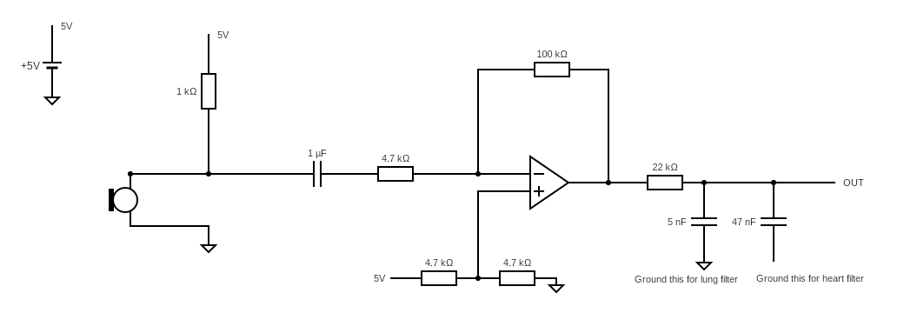
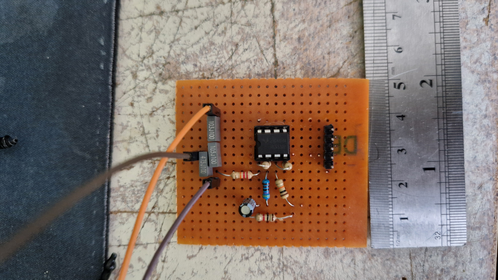
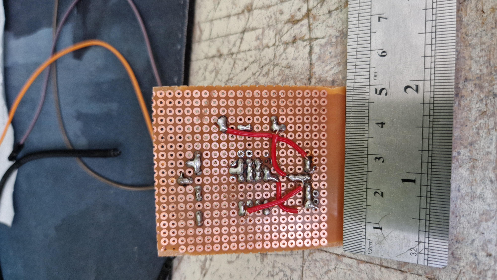
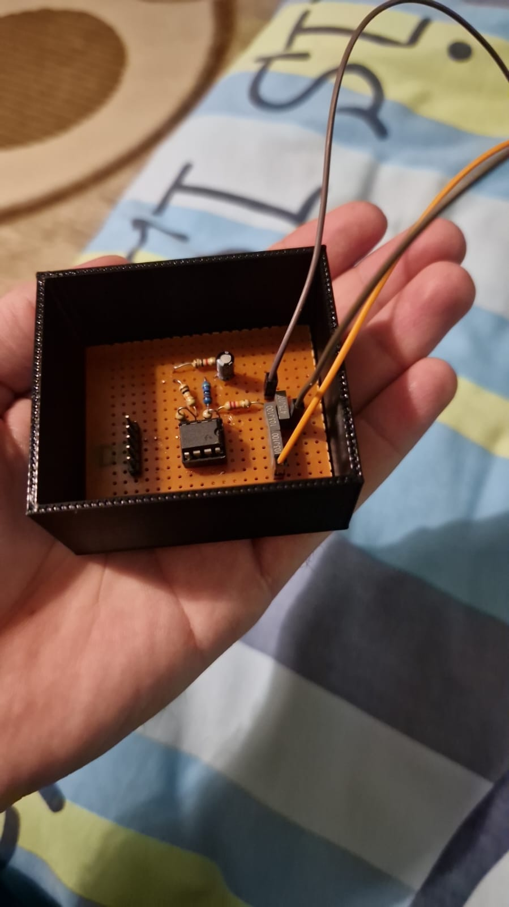
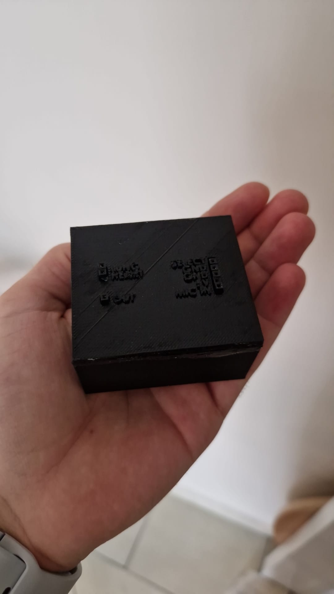

# Electric Stethoscope

This project is a simple electric stethoscope that can be used to listen to the body sounds of a patient. Prepared for AGU SAPA capsule final project.

## Pre-requisites

### Hardware

- Arduino Uno
- 2 wire electret microphone
- Doctor's stethoscope
- Resistors
  - 1 x 1kΩ
  - 1 x 4.7kΩ
  - 2 x 10kΩ
  - 1 x 22kΩ
  - 1 x 100kΩ
- Capacitors
  - 2 x 10nF (Connected in series for 5nF)
  - 1 x 47nF
  - 1 x 1uF
- 1 x Low-Noise Operational Amplifier (NE5532, TL072, etc.)
- Breadboard
- Jumper wires
- Optional:
  - Soldering iron and its accessories
  - Pertinax board to solder the circuit (or you can simply buy a PCB)
  - 3D printer to print the box for the circuit

### Software

- Arduino IDE
- LTspice
- Python 3.6 or higher

## Running the project

- Clone the repository
- Connect Arduino Uno to your computer
- Build the circuit following the [circuit diagram](https://crcit.net/c/c403772aff41427b846746d022f3cfba)
- Connect circuit to Arduino Uno
- Open the Arduino IDE and upload the `arduino/arduino.ino` file to the Arduino Uno
- Run Python server by running the following commands:

  ```bash
  cd app
  pip install -r requirements.txt
  python main.py
  ```

- Enjoy!

## Circuit Diagram



## Gallery






## Project Team

- Barış DEMİRCİ - <agu@338.rocks>
- Selin Nisa AKGÖL - <selinnisa.akgol@agu.edu.tr>
- Nuri İNCEÖZ - <nuri.inceoz@agu.edu.tr>
